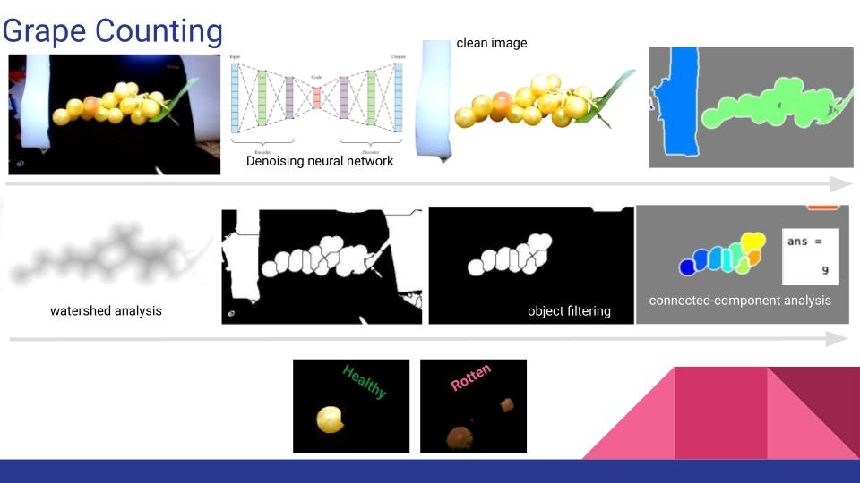

# grapes
image processing project with matlab

## More info
Image Processing: 

* Improving image quality (noise, lighting, etc)
	- to remove noise:
		- denoising neural network 
	- To improve contrast:
		- histogram equalisation
	- To improve lighting:
		- Various: (edge_detection, dilated, fill in holes, erode to smooth, binarise, invert, masking) 
* Finding individual grapes 
	- Segmenting grapes in the bunch
		- watershed
	- removing non-grape objects
		- filter objects by size 
* Counting the grapes:
	- connected components analysis
* Finding rotten grapes
	- unsupervised colour clustering
